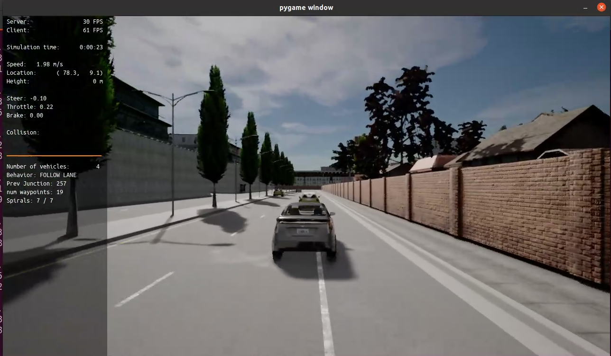
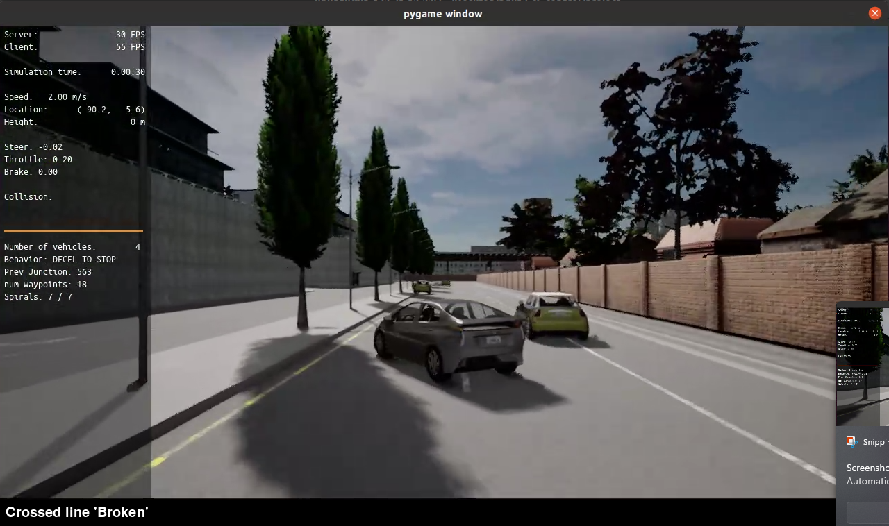
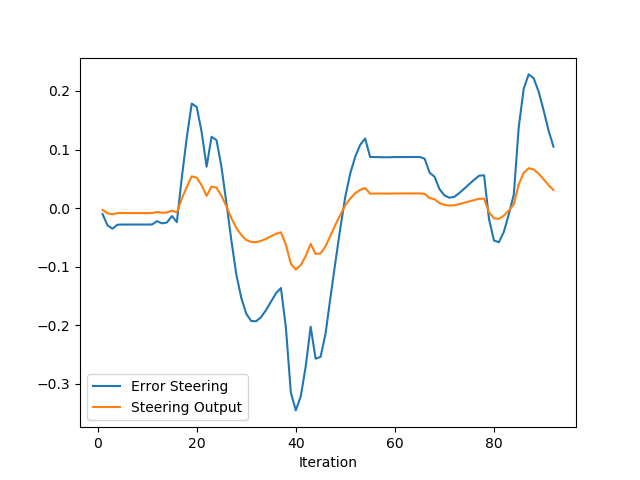
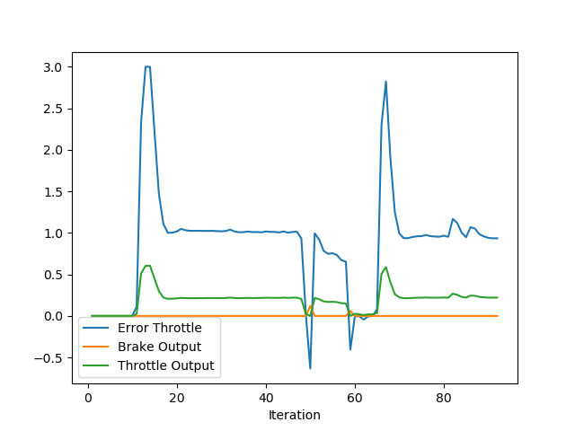

# PID Controller Performance Analysis

## Simulation Results and Plots

The simulation outputs include two sets of plots:

1. **Steering Control:**
   - Variables: Error steering and steering output.
   - Observations:
     - Initial oscillations in the error are observed, followed by gradual stabilization.
     - The steering output dynamically adjusts to counteract error and maintain stability.
2. **Throttle Control:**
   - Variables: Error throttle, brake output, and throttle output.
   - Observations:
     - Sharp spikes in throttle error at the beginning reflect an initial system imbalance.
     - The throttle output effectively compensates for errors to stabilize the system.

## Action of PID Components

- **Proportional (P):**
  - Reacts to the current error. This is responsible for the large initial corrections in both steering and throttle outputs when errors are significant.
- **Integral (I):**
  - Accumulates past errors, ensuring that steady-state errors are eliminated. Its effect can be observed in the gradual convergence of the error lines toward zero.
- **Derivative (D):**
  - Dampens oscillations by reacting to the rate of error change. This smooths the transitions in both steering and throttle outputs as the system stabilizes.

## Questions

1. **Automatic Tuning of PID Parameters:**
   - Use optimization algorithms like Genetic Algorithms or Reinforcement Learning to adaptively tune the PID gains based on performance metrics.
   - Alternatively, implement an automated trial-and-error tuning mechanism based on the Ziegler-Nichols or Cohen-Coon methods.
2. **Model-Free vs. Model-Based Controllers:**
   - **Model-Free Pros:**
     - Simple and easy to implement without requiring a detailed system model.
     - Robust to minor variations or disturbances.
   - **Model-Free Cons:**
     - Requires retuning for significant system changes.
     - Struggles with highly nonlinear dynamics.
   - **Model-Based Pros:**
     - Precise and optimized for specific system dynamics.
     - Predictive capabilities allow handling of complex scenarios.
   - **Model-Based Cons:**
     - Development complexity due to the need for an accurate system model.
     - Susceptibility to model inaccuracies affecting performance.
3. **Improvements to the PID Controller:**
   - **Gain Scheduling:** Dynamically adjust PID gains based on system conditions.
   - **Anti-Windup Techniques:** Prevent the integral term from growing too large during prolonged errors.
   - **Filter Integration:** Incorporate noise filters to reduce the impact of sensor noise on control actions.
   - **Feedforward Control:** Add anticipatory corrections using known disturbances or system inputs.
